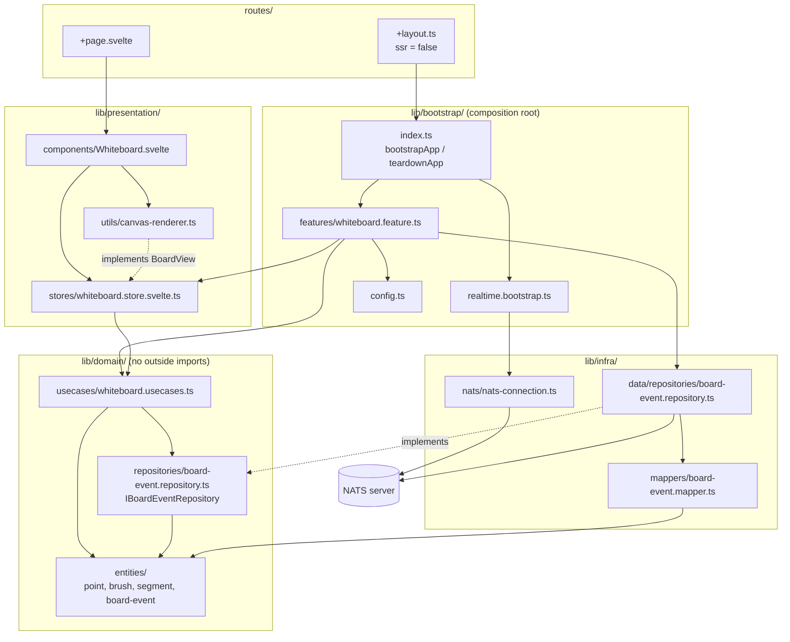
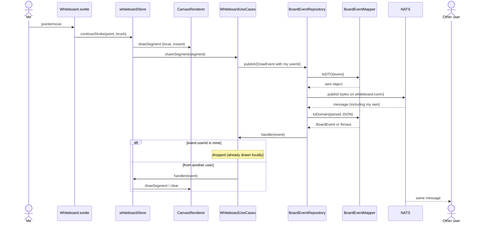
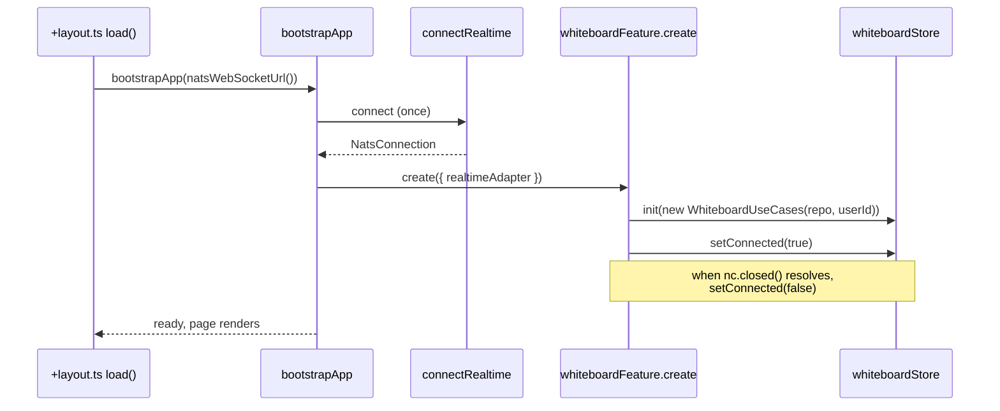

# Folder Structure

A SvelteKit 2 + Svelte 5 whiteboard that shares drawing events over NATS. Layered
("clean") architecture: dependencies point **down only**, and a composition root wires
the layers together.

```
Component (.svelte) -> Store -> UseCase -> Repository interface (domain)
                                                ^ implemented by
                                      Repository impl (infra) -> NATS + Mapper
```

## Layout

```
src/
  routes/
    +layout.ts                 ssr = false; calls bootstrapApp() on load
    +layout.svelte             global CSS, favicon
    +page.svelte               renders <Whiteboard />
  lib/
    domain/                    NO imports from infra, presentation or any library
      entities/                plain types: point, brush, segment, board-event
      repositories/            contracts (I*Repository) the domain needs
      usecases/                thin classes that depend on a repository interface
    infra/                     everything that talks to the outside world
      data/repositories/       implements a domain repository using NATS
      mappers/                 static, pure DTO <-> domain conversion (+ tests)
      nats/                    opens the NATS connection
    presentation/              everything the user sees
      stores/                  Svelte 5 rune state + actions (+ tests)
      components/              .svelte files
      utils/                   view helpers (canvas renderer)
    bootstrap/                 COMPOSITION ROOT: only place allowed to import all layers
      index.ts                 bootstrapApp() / teardownApp()
      realtime.bootstrap.ts    connects / disconnects NATS
      types.ts                 FeatureModule, FeatureAdapters
      config.ts                subject name, WebSocket URL
      features/                one module per feature + allFeatures[]
    utils/                     framework-free helpers (logger)
```

## Diagrams

### Layers and dependencies

Arrows mean "imports". `bootstrap` is the only layer that sees all the others.



### Drawing and receiving



### Startup



## What each layer may import

| Layer | May import | Must not import |
|---|---|---|
| `domain` | itself | infra, presentation, bootstrap, `nats.ws`, DOM |
| `infra` | domain, utils, `nats.ws` | presentation, bootstrap |
| `presentation` | domain, utils | infra, `nats.ws` |
| `bootstrap` | everything | n/a |
| `utils` | nothing from the app | all layers |

Rules of thumb:

- Components import **stores only**, never use cases or repositories.
- Stores never import the transport; they hold a use-case instance set via `init()`.
- Domain names never mention the technology (`IBoardEventRepository`, not `INats...`).
- Mappers are static and pure; never convert wire data inline in a repository.

## Where things live (this project)

| Concern | File |
|---|---|
| Wire format and validation | `infra/mappers/board-event.mapper.ts` |
| Publish / subscribe over NATS | `infra/data/repositories/board-event.repository.ts` |
| "Which events are mine" rule | `domain/usecases/whiteboard.usecases.ts` |
| Stroke tracking, connected flag | `presentation/stores/whiteboard.store.svelte.ts` |
| Drawing on the canvas | `presentation/utils/canvas-renderer.ts` |
| Wiring it all together | `bootstrap/features/whiteboard.feature.ts` |

## Request flow

**Drawing:** pointer event -> `Whiteboard.svelte` -> `whiteboardStore.continueStroke`
-> draws locally via `BoardView` -> `WhiteboardUseCases.shareSegment`
-> `BoardEventRepository.publish` -> `BoardEventMapper.toDTO` -> NATS.

**Receiving:** NATS -> `BoardEventRepository.subscribe` -> `BoardEventMapper.toDomain`
-> `WhiteboardUseCases.subscribeToRemoteEvents` (drops our own events)
-> store handler -> `BoardView.drawSegment`.

## Add-a-feature checklist

1. `domain/entities/foo.ts`
2. `domain/repositories/foo.repository.ts`
3. `domain/usecases/foo.usecases.ts`
4. `infra/mappers/foo.mapper.ts` (+ test)
5. `infra/data/repositories/foo.repository.ts`
6. `presentation/stores/foo.store.svelte.ts` (`init`, actions, `reset`)
7. `bootstrap/features/foo.feature.ts`, registered in `bootstrap/features/index.ts`
8. A component under `presentation/components/` and a route that renders it

## Testing

- Vitest, co-located: `foo.ts` -> `foo.test.ts`. Run with `npm test`.
- Test mappers, use cases with logic, stores and pure utils.
- Mock repository **interfaces**, not the transport.
- Skip components and repository implementations (integration territory).

## Conventions

- No `console.*`; use `createLogger('scope')` from `utils/logger.ts`.
- Relative imports inside `lib/`; the `$lib` alias is used from `routes/`.
- Never fetch or connect in `onMount`; connect in `+layout.ts` via `bootstrapApp()`.
  `onMount` is for binding the view and cleaning up.
